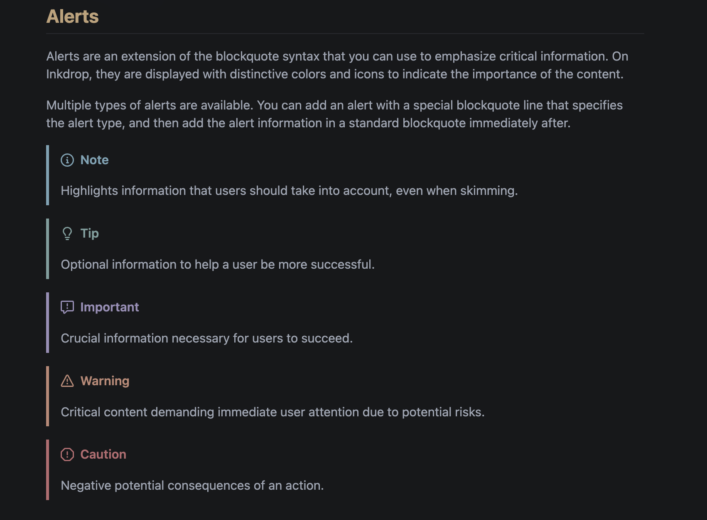
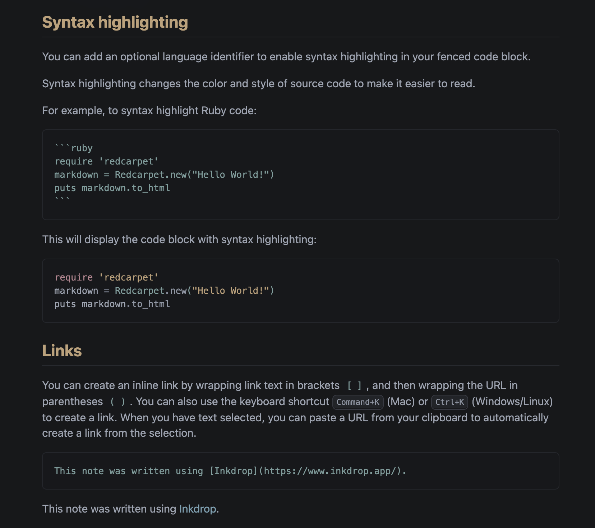
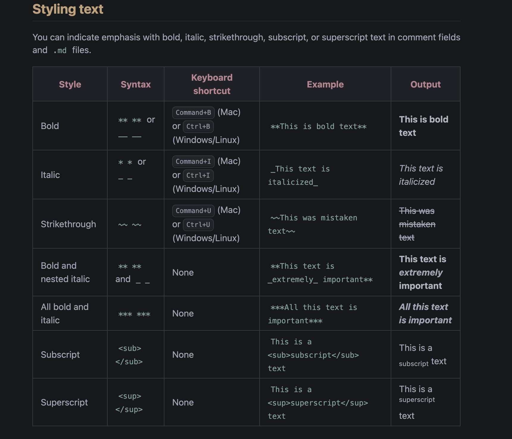

# Yūgure

A quiet twilight theme for [Inkdrop](https://www.inkdrop.app/).

Yūgure (夕暮れ) is Japanese for dusk. The theme sits on a neutral near-black
ground with softened body text, and uses six muted accents that each do one
job. The app chrome stays close to the editor background instead of competing
with it, and accents appear as text, never as solid fills. The result is dark
without being flat, and colourful without being loud.


## Install

```sh
ipm install yugure
```

Then pick **yugure** under **Preferences → Themes**.

## What it looks like

Alerts get one accent per kind: note in foam, tip in teal, important in iris,
warning in gold, caution in love.



Code blocks keep the same roles as prose: rose keywords, teal types, gold
strings, foam links.



Tables, inline code and keyboard chips stay quiet so the content reads first.



Headings step through the accents so document structure is visible at a
glance: h1 rose, h2 gold, h3 foam, h4 teal, h5 iris, h6 grey.

## Palette

| name  | hex       | role                                        |
| ----- | --------- | ------------------------------------------- |
| base  | `#141518` | editor background                           |
| text  | `#9DA4B2` | body text                                   |
| muted | `#5E6577` | comments, quotes, dates, placeholders       |
| rose  | `#B98590` | keywords, list bullets, table heads, h1     |
| gold  | `#BFA077` | strings, warnings, highlights, h2           |
| foam  | `#7AA3B5` | functions, links, info, primary buttons, h3 |
| teal  | `#7BA09F` | types, tags, inline code, additions, h4     |
| iris  | `#9A8EB9` | numbers, attributes, metadata, h5           |
| love  | `#BA6B70` | errors and deletions, nothing else          |

The same palette drives the author's Neovim, tmux, Alacritty and lazygit
setups, so notes and code look like they belong together.

## Contributing

Bug reports, polish and ideas are welcome.

**Found something off?** Open an issue with a screenshot and say which part of
the app it is in: the sidebar, the note list, the editor, the preview, or a
dialog. Mention your Inkdrop version and whether any other plugins are
enabled. Colour problems are much easier to fix with a picture.

**Want to change something?**

1. Fork the repository and create a branch from `main`.
2. Install and link the theme so Inkdrop loads your working copy:

   ```sh
   npm install
   ipm link --dev
   ```

   In Inkdrop, choose the theme under **Preferences → Themes** and reload
   the window after each change. `npx dev-server` gives you hot reload
   instead.

3. Edit the stylesheet that owns the area you are changing:

   - `styles/ui.css` for the app chrome: sidebar, note list, menus, dialogs.
   - `styles/syntax.css` for the editor and Markdown source.
   - `styles/preview.css` for the rendered preview and Mermaid diagrams.
   - `styles/tokens.css` holds the palette and the colour ramps everything
     else reads from. Change it only when a palette value itself changes.

4. Open a pull request against `main`. Describe what you changed and attach a
   before-and-after screenshot. Keep each PR to one topic so it is easy to
   review.

**A few ground rules** keep the theme coherent:

- Stick to the palette. If something needs a colour, use one of the six
  accents or a grey from the ladder. A new colour is a new role, not a new
  shade, and there are no spare roles.
- Love is for errors and deletions only. Never use it for syntax or emphasis.
- Prefer accents as text on a dark surface over filled backgrounds.
- Reference colours through the `--yugure-*` variables, never as hex in the
  three semantic stylesheets, so a palette tweak lands everywhere at once.

## License

MIT
